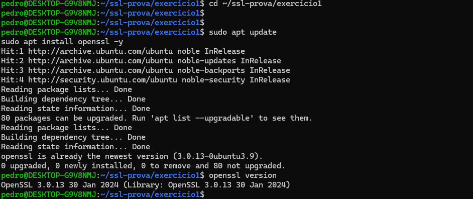

# Exercício 1 – Preparação do Ambiente

## Comandos utilizados:

sudo apt update  
sudo apt install openssl -y  
openssl version  

## Explicação:

O OpenSSL é uma ferramenta utilizada para trabalhar com criptografia e certificados digitais.  
Ele permite gerar chaves, certificados e garantir comunicação segura entre sistemas.

## Evidência:

