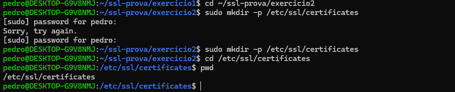

# Exercício 2 – Estrutura de Diretórios

## Comandos utilizados:

sudo mkdir -p /etc/ssl/certificates  
cd /etc/ssl/certificates  
pwd  

## Explicação:

Foi criado um diretório para armazenar certificados SSL no sistema.  
O diretório /etc/ssl é utilizado para arquivos relacionados à segurança.
## Evidência:

