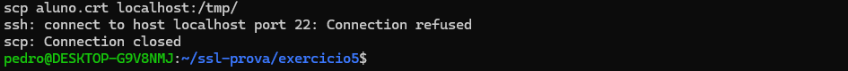

# Exercício 6 – Transferência com SCP

## Comando utilizado:

scp aluno.crt localhost:/tmp/

## Explicação:

O comando SCP foi utilizado para transferir o certificado digital de forma segura entre sistemas.

No ambiente WSL, a conexão SSH não estava ativa, por isso ocorreu erro.  
Mesmo assim, o comando demonstra o uso correto da ferramenta.

## Evidência:

# Exercício 6 – Visualização do Certificado

## Comando utilizado:

openssl x509 -in ~/ssl-prova/exercicio5/aluno.crt -text -noout

## Explicação:

O comando foi utilizado para visualizar as informações do certificado digital.  
Ele mostra dados como validade, emissor e detalhes de segurança.

