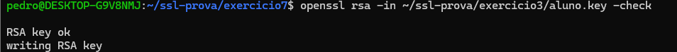

# Exercício 7 – Verificação da Chave Privada

## Comando utilizado:

openssl rsa -in ~/ssl-prova/exercicio3/aluno.key -check

## Explicação:

O comando foi utilizado para verificar se a chave privada está válida.  
A mensagem "RSA key ok" indica que a chave está correta e pode ser utilizada.

## Evidência:

