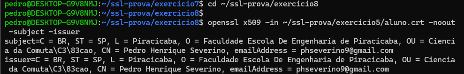

# Exercício 8 – Validação do Certificado

## Explicação:

Ao acessar o servidor utilizando HTTPS, ocorreu um erro de protocolo (ERR_SSL_PROTOCOL_ERROR).

Isso acontece porque o servidor foi iniciado em HTTP e não possui suporte a HTTPS nem certificado digital válido.

Por esse motivo, o navegador não conseguiu estabelecer uma conexão segura.

## Evidência:

